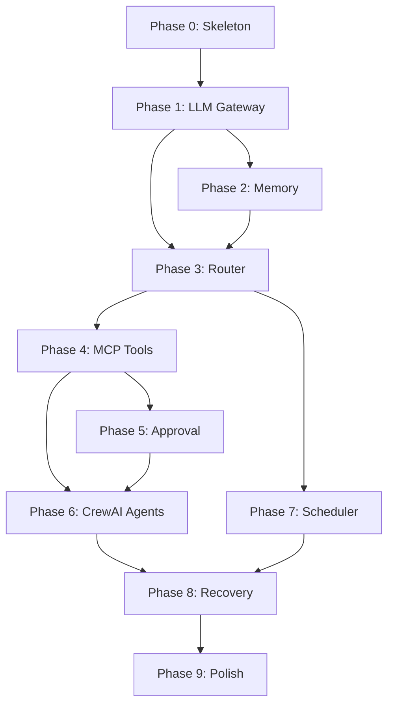

# Phased Implementation Plan — AI Agent System

> Each phase produces a **working, deployable system**. Never build in the dark — deploy, test, and validate before moving on.

---

## Phase 0 — Project Skeleton & Infrastructure (Day 1)

**Goal:** Deployable Python app with health endpoint, Supabase connected, Telegram bot responding.

### 0.1 Project Bootstrap

| Task | Details |
|------|---------|
| Init repo | `git init`, `.gitignore` (venv, .env, __pycache__), `README.md` |
| Create structure | `src/`, `src/config/`, `src/bot/`, `src/db/`, `scripts/`, `tests/` |
| Dependencies | `requirements.txt` — `python-telegram-bot`, `sqlalchemy`, `psycopg2-binary`, `python-dotenv`, `flask` |
| Environment | `.env.example` with all vars, `src/config/settings.py` to load them |
| Logging | `src/utils/logging.py` — structured logger with `LOG_LEVEL` support |

### 0.2 Database

| Task | Details |
|------|---------|
| Create Supabase project | Region: US West (closest to Render Oregon) |
| Enable pgvector | `CREATE EXTENSION IF NOT EXISTS vector;` |
| Run bootstrap schema | Only tables needed now: `system_state`, `conversations`, `tasks` |
| Connection module | `src/db/connection.py` — SQLAlchemy + `NullPool` |
| Test script | `scripts/setup_db.py` — creates tables if not exist, prints status |

### 0.3 Telegram Bot (Echo)

| Task | Details |
|------|---------|
| Create bot | Talk to @BotFather, get token |
| Bot module | `src/bot/telegram_bot.py` — `Application` setup |
| Handlers | `src/bot/handlers.py` — `/start`, `/help`, echo handler (replies with what you sent) |
| Admin guard | Middleware that checks `message.from_user.id == TELEGRAM_ADMIN_USER_ID` |

### 0.4 Health & Deployment

| Task | Details |
|------|---------|
| Health endpoint | `scripts/health_ping.py` — Flask `/health` route that pings DB |
| Entry point | `src/main.py` — starts both Telegram bot and health server (threading) |
| `render.yaml` | Web service config |
| `Dockerfile` | Python 3.11 slim |
| Deploy to Render | Set env vars, verify `/health` returns 200 |
| Keep-alive | cron-job.org → ping `/health` every 14 min |

### ✅ Milestone: Bot responds to messages, health endpoint live, DB connected

---

## Phase 1 — LLM Gateway & Simple Conversations (Days 2–3)

**Goal:** Telegram bot answers questions via OpenRouter with caching and rate limiting.

### 1.1 LLM Gateway (Core)

| Task | Details |
|------|---------|
| Gateway | `src/llm/gateway.py` — single `async def complete(prompt, model_tier)` entry point |
| Model router | `src/llm/model_router.py` — maps tier → model name from `src/config/models.py` |
| OpenRouter client | HTTP calls to `https://openrouter.ai/api/v1/chat/completions` |
| Rate limiter | `src/llm/rate_limiter.py` — token bucket, 10 req/min, 100 req/hr |
| Cache | `src/llm/cache.py` — hash prompt → check `cache` table → return if hit |

### 1.2 Fallback Chain

| Task | Details |
|------|---------|
| Fallback logic | `src/llm/fallback_chain.py` — if primary model 429/500 → try fallback model |
| Cooldown | On 429, back off for `cooldown_on_429` seconds |
| Logging | Log every LLM call: model used, tokens, latency, cache hit/miss |

### 1.3 Conversation Flow

| Task | Details |
|------|---------|
| Update handlers | `/start` greeting, free-text messages → LLM gateway (lightweight tier) |
| Conversation storage | Save user messages + assistant responses to `conversations` table |
| Task tracking | Create `tasks` row for each request (type=simple, track tokens/model) |
| `/status` command | Show: total tasks, tokens used, cache hit rate |

### ✅ Milestone: Ask the bot anything via Telegram, get LLM-powered responses, cached and rate-limited

---

## Phase 2 — Memory System (Days 4–6)

**Goal:** Bot remembers context within sessions and learns facts across sessions.

### 2.1 Working Memory

| Task | Details |
|------|---------|
| Module | `src/memory/working_memory.py` — in-memory dict keyed by session_id |
| Behavior | Accumulate messages for current session, pass as conversation history to LLM |
| Session management | New session after 30 min gap or `/start` |

### 2.2 Short-Term Memory

| Task | Details |
|------|---------|
| Module | `src/memory/short_term.py` — query recent `conversations` rows for session |
| Token counter | `src/utils/tokens.py` — `tiktoken` or simple word-count estimator |
| Threshold check | If conversation > `TOKEN_THRESHOLD` (5000), trigger summarization |

### 2.3 Summarization

| Task | Details |
|------|---------|
| Summarizer | `src/memory/summarizer.py` — send old messages to LLM (system tier) for summarization |
| Storage | Save summary to `summaries` table, mark old messages as `summarized=TRUE` |
| Context assembly | Load: working memory + recent unsummarized + relevant summaries |

### 2.4 Long-Term Memory (Facts + Embeddings)

| Task | Details |
|------|---------|
| Fact extractor | `src/memory/fact_extractor.py` — after each conversation, extract facts via LLM |
| Facts storage | Save to `facts` table with category, key, value, confidence |
| Embeddings | `src/utils/embeddings.py` — `sentence-transformers` (all-MiniLM-L6-v2) |
| Vector storage | Embed facts + summaries → `memory_embeddings` table |
| Semantic search | `src/memory/long_term.py` — cosine similarity search via pgvector |
| Context enricher | `src/router/context_enricher.py` — search relevant facts before LLM call |

### 2.5 Memory Conflict Resolution

| Task | Details |
|------|---------|
| Conflict detector | `src/memory/conflict_resolver.py` — check for contradicting facts on same key |
| User prompt | Send Telegram message with both facts + inline buttons [Use NEW] [Keep OLD] |
| Resolution storage | Update `superseded_by` field on old fact |

### 2.6 Memory Commands

| Task | Details |
|------|---------|
| `/memory` | Show: total facts, embeddings count, storage usage |
| `/memory forget <id>` | Delete a specific fact |

### ✅ Milestone: Bot remembers your preferences, summarizes long conversations, retrieves relevant context semantically

---

## Phase 3 — Request Router & Task Classification (Day 7)

**Goal:** Bot intelligently routes requests: simple → direct LLM, complex → queue for agents, scheduled → scheduler.

### 3.1 Intent Parser

| Task | Details |
|------|---------|
| Module | `src/router/intent_parser.py` — LLM call (lightweight tier) to extract intent |
| Output | `{action, entities, urgency, complexity_hint}` |

### 3.2 Task Classifier

| Task | Details |
|------|---------|
| Module | `src/router/task_classifier.py` — classify as simple/complex/scheduled |
| Rules | Simple: Q&A, formatting, lookups. Complex: multi-step, tool-using. Scheduled: recurring/future |
| Sensitivity | Check if required tools are in `TOOL_SENSITIVITY` → flag for approval |

### 3.3 Priority Queue

| Task | Details |
|------|---------|
| Module | `src/llm/request_queue.py` — priority queue (P0–P3) |
| Behavior | Interactive messages = P0, background tasks = P2, scheduled = P3 |
| Integration | LLM gateway pulls from queue in priority order |

### ✅ Milestone: Messages are classified and routed — simple ones answered directly, complex ones queued

---

## Phase 4 — MCP Servers & Tools (Days 8–11)

**Goal:** Bot can interact with email, calendar, and the web through standardized MCP tools.

### 4.1 MCP Framework

| Task | Details |
|------|---------|
| Client | `src/mcp/client.py` — call tools by name, pass params, get results |
| Registry | `src/mcp/tools_registry.py` — register all tools, map to sensitivity config |
| Base server | Common structure for all MCP servers (init, expose tools, error handling) |

### 4.2 Scraper MCP Server (Easiest — no auth, read-only)

| Task | Details |
|------|---------|
| Module | `src/mcp/servers/scraper_server.py` |
| `fetch_page(url)` | `httpx` + `BeautifulSoup` → cleaned text |
| `search_web(query)` | DuckDuckGo search API (or scraping) |
| `extract_data(url, schema)` | Fetch + LLM extraction to match schema |
| `screenshot_page(url)` | `playwright` or skip initially (high memory) |

### 4.3 Email MCP Server

| Task | Details |
|------|---------|
| Module | `src/mcp/servers/email_server.py` |
| `read_emails()` | IMAP connection to Gmail, fetch recent |
| `search_emails()` | IMAP SEARCH command |
| `draft_email()` | Compose MIME message, store as draft in Gmail |
| `send_email()` | SMTP send — **REQUIRES APPROVAL** |
| `delete_email()` | IMAP flag as deleted — **REQUIRES APPROVAL** |

### 4.4 Calendar MCP Server

| Task | Details |
|------|---------|
| Module | `src/mcp/servers/calendar_server.py` |
| `get_events()` | Google Calendar API — list events in range |
| `check_availability()` | Freebusy query |
| `create_event()` | Create event — **REQUIRES APPROVAL** |
| `modify_event()` | Patch event — **REQUIRES APPROVAL** |
| `delete_event()` | Delete event — **REQUIRES APPROVAL** |
| Auth | Service account or OAuth2, credentials from `GOOGLE_CREDENTIALS_JSON` |

### ✅ Milestone: Bot can search the web, read your email, check your calendar (read-only works without approval)

---

## Phase 5 — Approval System (Days 12–13)

**Goal:** Sensitive actions (send email, create event, delete) require explicit user approval via Telegram buttons.

### 5.1 Approval Gateway

| Task | Details |
|------|---------|
| Module | `src/approval/gateway.py` — intercept sensitive tool calls |
| Check | Look up tool in `TOOL_SENSITIVITY` → if `True`, create approval request |
| Bypass | If tool is not sensitive, execute immediately |

### 5.2 Approval Queue & UI

| Task | Details |
|------|---------|
| Queue | `src/approval/queue.py` — store pending approval in `approvals` table |
| Telegram message | Send rich preview: "🔒 **Approval Required** — Send email to X with subject Y" |
| Inline buttons | `src/bot/keyboards.py` — [✅ Approve] [❌ Reject] [✏️ Edit] |
| Callbacks | `src/approval/handlers.py` — handle button presses |
| Timeout | If no response in `APPROVAL_TIMEOUT_HOURS`, mark as expired, notify user |

### 5.3 Approval Commands

| Task | Details |
|------|---------|
| `/pending` | List all pending approvals with IDs |
| Expiry cleanup | Background task to expire old approvals |

### ✅ Milestone: Sending an email requires tapping ✅ in Telegram first — safety layer complete

---

## Phase 6 — CrewAI Agents (Days 14–17)

**Goal:** Complex, multi-step tasks handled by specialized AI agents working together.

### 6.1 Agent Framework

| Task | Details |
|------|---------|
| Crew manager | `src/agents/crew_manager.py` — create and orchestrate CrewAI crews per task type |
| Agent prompts | `src/agents/prompts/agent_prompts.py` — role, goal, backstory for each agent |
| Tool binding | Agents get access to MCP tools through CrewAI's tool interface |

### 6.2 Individual Agents

| Agent | File | Capabilities |
|-------|------|-------------|
| Email Agent | `src/agents/email_agent.py` | Read, search, draft, send (with approval) |
| Research Agent | `src/agents/research_agent.py` | Web search, page fetch, data extraction |
| Calendar Agent | `src/agents/calendar_agent.py` | Check availability, create/modify events |

### 6.3 Crew Compositions

| Crew | Agents | Example Task |
|------|--------|------------|
| Email Research | Research + Email | "Find the best flight deals and email me a summary" |
| Schedule Planning | Calendar + Research | "Find a good time for a team dinner next week" |
| Full Stack | All three | "Research X, summarize, email to Y, and schedule a follow-up" |

### 6.4 Integration

| Task | Details |
|------|---------|
| Router hookup | Task classifier routes `complex` tasks to `crew_manager` |
| Model tiers | Agents use `capable` tier for reasoning, `balanced` for drafting |
| Task tracking | Each agent step creates sub-tasks in `tasks` table |

> [!WARNING]
> **Memory pressure.** CrewAI + multiple agents can easily exceed 512 MB. Profile memory usage here. Consider lazy-loading agents and running only one crew at a time.

### ✅ Milestone: "Research the top 3 restaurants near me and email me a summary" — works end-to-end

---

## Phase 7 — Scheduler (Days 18–20)

**Goal:** Bot can run tasks on a schedule — daily email digests, weekly calendar summaries, etc.

### 7.1 Scheduler Engine

| Task | Details |
|------|---------|
| Engine | `src/scheduler/engine.py` — main loop, checks `next_run` every 60 sec |
| Job store | `src/scheduler/job_store.py` — CRUD on `scheduled_jobs` table |
| Triggers | `src/scheduler/triggers.py` — cron expression parser, interval, one-time |

### 7.2 Job Execution

| Task | Details |
|------|---------|
| Execution | When `next_run <= now()`, create a task from `task_template`, route through classifier |
| Approval modes | `pre_approved` (skip approval), `each_time` (always ask), `review_window` (ask if user is active) |
| Missed jobs | `src/scheduler/missed_jobs.py` — `<15 min late: run`, `>1 hr late: skip + notify` |

### 7.3 Schedule Commands

| Task | Details |
|------|---------|
| `/schedule list` | Show all jobs: name, schedule, last/next run, status |
| `/schedule add` | Conversational flow to create a new scheduled job |
| `/schedule pause <id>` | Disable a job |
| `/schedule resume <id>` | Re-enable, recalculate next_run |
| `/schedule delete <id>` | Remove job |

### ✅ Milestone: "Every Monday at 9 AM, summarize my unread emails" — works automatically

---

## Phase 8 — Recovery & Hardening (Days 21–23)

**Goal:** System gracefully handles crashes, restarts, and edge cases.

### 8.1 Startup Recovery

| Task | Details |
|------|---------|
| Module | `src/recovery/startup.py` — full startup flow |
| Health check | Verify DB, OpenRouter, Telegram connectivity |
| Pending tasks | Query `tasks` with status `in_progress` → resume non-destructive, ask user for destructive |
| Pending approvals | Query `approvals` with status `pending` → re-send Telegram message if not expired |
| Scheduled jobs | Recalculate `next_run` for all enabled jobs, handle missed |
| Status notification | Send user a Telegram message: "🟢 System restarted. N tasks resumed, M approvals pending." |

### 8.2 Health Monitoring

| Task | Details |
|------|---------|
| Module | `src/recovery/health_check.py` — periodic internal health check |
| Checks | DB connection, OpenRouter reachability, memory usage, queue depth |
| Alerting | If health check fails, notify user via Telegram |

### 8.3 Error Handling Patterns

| Pattern | Implementation |
|---------|---------------|
| Retry with backoff | LLM calls: 3 retries, exponential backoff (1s, 2s, 4s) |
| Circuit breaker | If a service fails 5x in 10 min, stop calling it for 5 min |
| Graceful degradation | If OpenRouter down → notify user, queue requests |
| Task checkpoints | Save `checkpoint` JSONB in tasks table for resumable work |

### 8.4 Commands

| Task | Details |
|------|---------|
| `/status` (enhanced) | System health, uptime, memory, queue, last errors |
| `/tasks` | List recent tasks with status, duration, model used |
| `/cancel` | Cancel current in-progress operation |

### ✅ Milestone: Kill the process, restart — system picks up where it left off

---

## Phase 9 — Polish & Optimization (Days 24–26)

**Goal:** Production-ready quality for personal use.

### 9.1 Testing

| Task | Details |
|------|---------|
| Unit tests | LLM gateway (mock OpenRouter), memory manager, task classifier, approval flow |
| Integration tests | DB operations, MCP tool calls with mocked external services |
| Mocking strategy | `unittest.mock` for Gmail IMAP, Google Calendar API, OpenRouter |
| Coverage | Target: 70%+ on core modules (`llm/`, `memory/`, `approval/`, `router/`) |

### 9.2 Optimization

| Task | Details |
|------|---------|
| Memory profiling | `tracemalloc` — identify heavy modules, optimize imports |
| Lazy loading | Only import CrewAI/sentence-transformers when needed |
| Connection efficiency | Verify NullPool is working, no connection leaks |
| Cache tuning | Analyze hit rate, adjust TTL |

### 9.3 Documentation

| Task | Details |
|------|---------|
| Update CLAUDE.md | Reflect final structure |
| Update ARCHITECTURE.md | Add any design changes from implementation |
| README.md | User-facing setup guide, screenshots, feature list |

### ✅ Milestone: Tests pass, memory under 450 MB, docs complete — ready for daily use

---

## Summary Timeline

| Phase | Name | Duration | Cumulative |
|-------|------|----------|-----------|
| 0 | Skeleton & Infrastructure | Day 1 | Day 1 |
| 1 | LLM Gateway & Conversations | Days 2–3 | Day 3 |
| 2 | Memory System | Days 4–6 | Day 6 |
| 3 | Router & Classification | Day 7 | Day 7 |
| 4 | MCP Servers & Tools | Days 8–11 | Day 11 |
| 5 | Approval System | Days 12–13 | Day 13 |
| 6 | CrewAI Agents | Days 14–17 | Day 17 |
| 7 | Scheduler | Days 18–20 | Day 20 |
| 8 | Recovery & Hardening | Days 21–23 | Day 23 |
| 9 | Polish & Optimization | Days 24–26 | Day 26 |

> [!TIP]
> **"Days" are work-days, not calendar days.** Pace yourself. Each phase is designed to be independently useful — you can pause after any phase and have a working system.

---

## Dependency Graph

> [!IMPORTANT]
> **Phase 4 (MCP Tools) and Phase 5 (Approval) must both be done before Phase 6 (CrewAI Agents)**, because agents need tools and tools need the safety layer. Phase 7 (Scheduler) can be built in parallel with Phase 6 if you want to speed things up.
