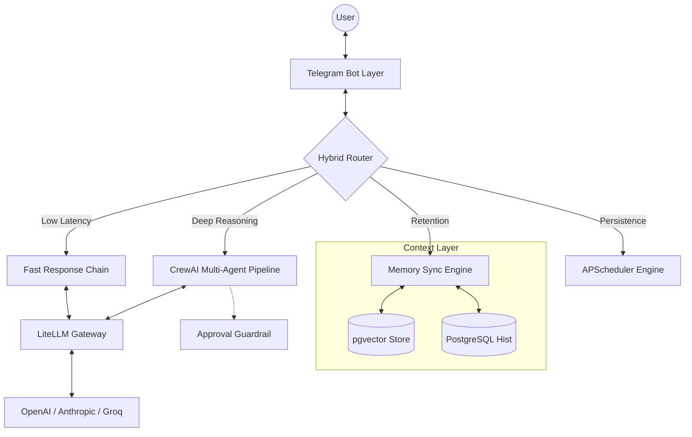

# How I Built a Multi-Agent AI Assistant in Telegram

*From a simple stateless chatbot to a proactive, multi-agent personal assistant living in my messaging app.*

---

**By Ksawyoux**  
*Read time: 8 minutes*

It started with a simple frustration. I had ChatGPT open in one tab, Claude in another, and my calendar and notes scattered everywhere else. I found myself endlessly copying and pasting context. The LLMs were incredibly smart, but they were trapped in their web wrappers. They had no memory of what I told them yesterday, and they couldn't take any action on my behalf.

I didn't want another chat interface. I wanted a true assistant—one that lived right where I already spend my day: Telegram. And I wanted it to be functionally trusted with my life.

This is the story of how that frustration evolved into **Astra AI**, a multi-agent orchestrated personal assistant. Here is how I combined Python, LiteLLM, CrewAI, PostgreSQL (`pgvector`), and a custom Skills Engine to build it.



## Chapter 1: The Stateless Void 

The first version of Astra was just a wrapper. I plugged in the Telegram API and forwarded messages to the OpenAI API. It was fast, but it was dumb. Every message was a blank slate.

Most LLMs are fundamentally stateless. When you try to build a "continuous" personal assistant, the primary challenge becomes **Memory & Context**. How do you get the bot to "remember" who you are without stuffing 100,000 tokens of chat history into every prompt (and going bankrupt)?

### The Solution: Adaptive Memory using Pgvector

The standard approach to bot memory is a rolling context window. Astra AI uses that for short-term conversation flow, but I wanted it to organically "learn" facts about me over time. 

I implemented a background extraction engine. While I talk to the bot, a secondary, asynchronous LLM process runs in the background. It listens for "permanent" facts (e.g., *"I prefer emails over meetings"*, or *"I am learning Rust this week"*). 

These facts are converted into embeddings and stored in a PostgreSQL database using the `pgvector` extension. Now, when I ask a question, Astra AI performs a fast semantic similarity search across this vector store, silently injecting only the top 3-4 highly relevant facts into the prompt's context window. 

Suddenly, the bot wasn't just answering questions; it felt like it actually knew me. But it still couldn't *do* anything.

## Chapter 2: Giving the Bot Hands 

I needed Astra to perform complex tasks: scraping the web, reading documentation, and managing my calendar. For this, I integrated **CrewAI** to orchestrate multi-agent pipelines. 

But this introduced two massive new problems: Latency and Safety.

### The Latency Problem: Hybrid Task Routing

If every simple request (*"What's the weather?"*) spun up a complex CrewAI pipeline, the bot would take 60 seconds to answer basic questions. 

To solve this, I built a **Classification Router** right at the entry point of the Telegram payload:
- **Fast Stream:** Simple conversational tasks are routed to a lightweight, fast LLM layer directly via a LiteLLM gateway (allowing me to hot-swap between models instantly).
- **Agentic Stream:** Complex requests (*"Research the top 5 emerging AI agent frameworks and draft a blog post outline"*) are routed to the CrewAI multi-agent pipeline.

This hybrid approach resulted in sub-second latency for standard queries, while reserving the heavy-lifting for when it was actually needed.

### The Safety Problem: Human-in-the-Loop "Approval Guardrails"

Once my agents could access my Google Calendar, I realized the danger. If an AI hallucinated a destructive action, it could wipe out my week. I needed absolute certainty it wouldn't act maliciously or out of stupidity. 

I engineered an **Approval Guardrail** system. When an agent reaches a stage where it needs to mutate external state (like creating an event), the execution pauses. The state of the workflow is saved to the database, and the bot pings me on Telegram with an inline keyboard:

```text
⚠️ [APPROVAL REQUIRED] ⚠️
Agent: CalendarManager
Action: Book Meeting with John at 2 PM.

[ APPROVE ]   [ REJECT ]
```

The agent sits in a suspended wait state until I click `[ APPROVE ]`. This click-to-verify system completely mitigates the risk of catastrophic AI failure.

## Chapter 3: Infinite Extensibility 

With the routing, memory, and safety protocols in place, the foundation was solid. But I realized that hardcoding every new agent or capability was brittle. If I wanted to add a "Marketing" agent or a "Code Review" agent, it required tearing into the core logic.

### Custom Skills Integration

So, I built a dynamic **Skills Engine**. Astra AI is designed to be easily extensible. Skills are defined as independent modules that the Hybrid Router can dynamically load. 

When I added marketing capabilities recently, I simply dropped the new skill configurations into the `skills` directory. The Router automatically parses the natural language prompt, identifies if a custom skill (like "Generate Marketing Copy") is required, and dynamically loads the necessary context and tools for that specific action. This means the assistant's capabilities can grow infinitely without bloating the core routing logic.

## The Symphony of Agents and Context

To truly understand how this evolution came together, consider what happens when I send the message: *"Schedule a meeting to review my new Rust curriculum."*

1. **The Router** intercepts the message, categorizes it as a complex task, and routes it to the **Agentic Stream**.
2. **The Memory Engine** fires simultaneously, searching `pgvector` for "Rust curriculum", and injects my saved preferences (*"User studies Rust on Tuesday evenings"*) into the Agent's context.
3. The **Skills Engine** ensures the Calendar Agent has the right tools loaded.
4. The **CrewAI Agent** drafts the calendar invite for 7:00 PM on Tuesday.
5. Before saving, execution pauses, triggering the **Approval Guardrail** on my phone.

One click, and the task is done securely.

## Looking Forward

Astra AI started as an experiment in taming stateless LLMs, but it’s become my daily driver. The transition from *prompt-response* to *delegation-authorization* fundamentally changes how you interact with AI.

The codebase is engineered to scale. My roadmap includes direct API integration with Google Drive for complex document analysis and setting up continuous, cron-scheduled background tasks using the APScheduler implementation.

If you are a developer looking to break out of basic Chat-UI implementations, I highly recommend orchestrating native API integrations. Let the agents do the hard work.

*Check out the [Astra AI GitHub Repository here](#) to see the source code.*
