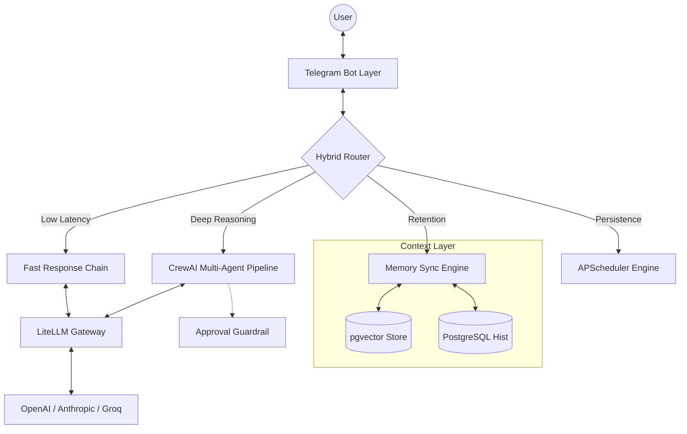

# Astra AI: Your Personal Intelligent Agent
**Bridging the gap between raw LLMs and proactive productivity.**

  *(Insert High-Quality GIF or Mockup of Bot Interaction Here)*

## Overview

**My Role:** Lead Developer / AI Architect  
**Timeline:** *[Insert Timeline]*  
**Tech Stack:** Python, LiteLLM, CrewAI, PostgreSQL (pgvector), Telegram API, APScheduler

**Astra AI** is an intelligent, multi-agent personal assistant integrated directly into Telegram. Unlike standard chat interfaces (like ChatGPT) that reset context and rely purely on immediate text generation, Astra is designed to be a true *assistant*. It maintains a dual-layer memory system, orchestrates highly capable AI agents to perform complex workflows (like web research and calendar management), and includes an enterprise-grade human-in-the-loop approval system.

### The Problem
Standard large language models lack deep context of the user's life and cannot reliably execute real-world actions on their behalf without hallucinating or making potentially destructive mistakes. Furthermore, to be truly useful, an assistant needs to be instantly accessible via a native messaging platform, not sequestered in a web app.

### The Solution
I built a unified Telegram bot that routes user intents locally. Simple questions are answered instantly via a fast LLM layer, while complex tasks are delegated to a multi-agent orchestration framework. To prevent dangerous actions (like sending an email or booking a calendar event by accident), the bot securely requests human authorization via interactive Telegram controls before executing any mutating state.

---

## Key Engineering Achievements

### 1. Hybrid Task Routing Architecture
To optimize for both **cost** and **latency**, not every message requires a heavy, multi-agent pipeline. I implemented a Classification Router that analyzes incoming messages:
- **Low-Latency Intraction:** Simple tasks and conversational queries are handled by a lightweight model using LiteLLM (which provides provider agnosticism—allowing rapid swapping between OpenAI, Anthropic, and open-source models).
- **Deep Reasoning (CrewAI Pipelines):** Complex tasks (e.g., *"Research this topic and outline a blog post"*) are routed to specialized CrewAI agents.

### 2. Adaptive Memory Engine (pgvector)
A truly useful assistant needs to remember who you are. I designed a two-tier memory system:
1. **Short-Term Context Window:** Dynamically summarizes recent conversation history based on token density.
2. **Long-Term Fact Store:** A background processing engine that extracts permanent user details (preferences, habits, important facts) from casual conversation, storing them as vector embeddings in PostgreSQL via `pgvector`. When relevant topics arise, the bot performs semantic retrieval to bring these facts back into context.

  *(Insert Screenshot showing the `/memory` command and extracted user facts)*

### 3. Human-in-the-Loop Approval Guardrails
Agentic AI can be dangerous if given unchecked access to your tools. I built a secure **Approval Guardrail** system for high-impact actions. 
If an agent needs to manipulate external state (like modifying a calendar or executing a transaction), the action is paused and stored in an Approval Queue. The admin receives a Telegram message with interactive buttons (`Approve` / `Reject`). No external state is modified without cryptographic-level click-to-verify confirmation.

  *(Insert Screenshot showing the bot requesting approval for an action)*

### 4. Asynchronous Task Scheduling
Built an advanced scheduling engine using APScheduler. Users can make natural-language timing requests (e.g., *"remind me every Monday at 9am to check metrics"*) which are dynamically parsed by the LLM into cron jobs that execute background tasks continuously.

---

## Architectural Breakdown

---

## Future Roadmap & Lessons Learned

Building Astra AI highlighted the complexities of bridging stateless APIs with stateful, asynchronous messaging platforms.

- **Asynchronous State Management:** One of the hardest bugs was maintaining consistent state between Telegram's polling mechanisms and long-running CrewAI pipelines. I solved this by implementing an atomic database queuing system to track task status and output independently.
- **Provider Agnosticism:** By placing LiteLLM in the critical path early on, the application became entirely insulated from vendor API changes. Changing the core intelligence model is now as simple as updating an environment variable.

Astra AI is continually evolving. Up next is expanding the tool ecosystem to include direct integrations with Google Drive and Notion for deeper workflow automation.

---
*For a deeper dive into the code, check out the [GitHub Repository](https://github.com/Ksawyoux/MyBot-ksawyoux-).*
